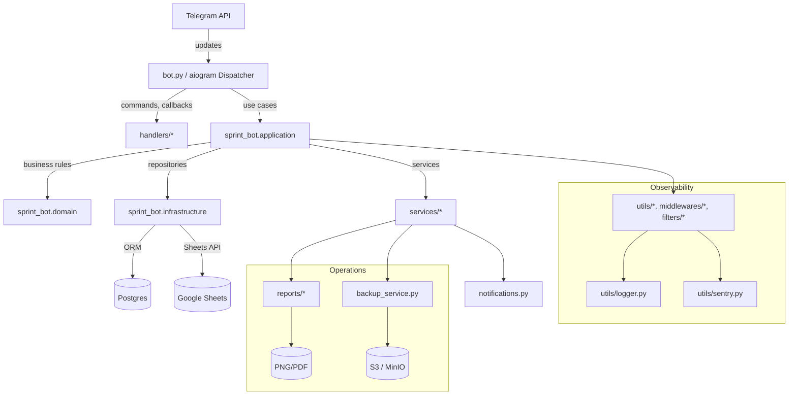

# ARCHITECTURE.md — шарова архітектура Sprint-Bot

Sprint-Bot поєднує легасі aiogram-хендлери та нову модульну структуру `sprint_bot`. Мета — поступово перенести доменну логіку в нові шари, не зупиняючи функціональний реліз.

## Огляд шарів

## Ключові компоненти

- **bot.py** — створює `Bot`, `Dispatcher`, підключає middlewares, DI та запускає полінг/вебхук.
- **handlers/** — aiogram-хендлери команд `/newsprint`, `/progress`, онбординг і адмін-панель.
- **sprint_bot.application** — сучасні use-case-и, які ізолюють логіку від телеграм-хендлерів.
- **sprint_bot.domain** — обчислення сплітів, моделей спринту, нормалізація результатів.
- **sprint_bot.infrastructure** — репозиторії Postgres і адаптери Google Sheets.
- **services/** — процедурні сервіси для аналітики, експорту, команд backup, які ще не перенесені в нову архітектуру.
- **reports/** — генерація графіків, CSV, зображень результатів.
- **utils/** — логування, робота з персональними даними, допоміжні утиліти.
- **alembic/**, **db/** — міграції та SQLAlchemy-моделі.

## Потік даних

1. Telegram надсилає оновлення → `bot.py` маршрутизує їх у Dispatcher.
2. Dispatcher викликає відповідний хендлер (`handlers/` або новий use-case в `sprint_bot.application`).
3. Хендлер звертається до сервісів (`services/`, `reports/`) або до шарів application/domain/infrastructure за даними.
4. Інфраструктурний шар читає дані з Postgres (`infra/db`) чи Google Sheets (`scripts/import_sheets` для синхронізації).
5. Результат повертається в Telegram через методи aiogram, або потрапляє у звіти/бекопи/сповіщення.

## Зовнішні залежності

- **Telegram Bot API** — основний канал взаємодії.
- **Postgres 15** — первинне сховище (через async SQLAlchemy та Alembic).
- **Google Sheets** — імпорт/експорт даних команди (gspread).
- **S3/MinIO** — зберігання резервних копій (`backup_service.py`).
- **Sentry** — моніторинг, збір логів і алертів.

## План еволюції

- Перемістити обробники з `services/` у `sprint_bot.application` з чіткими інтерфейсами.
- Оновити інфраструктуру на патерн `Unit of Work` та централізувати DI.
- Додати HTTP-endpoint для health/ready проб, щоб моніторинг не залежав від Telegram.
- Розширити тестовий шар, покривши нові модулі end-to-end сценаріями (`tests/sprint_bot/*`).

