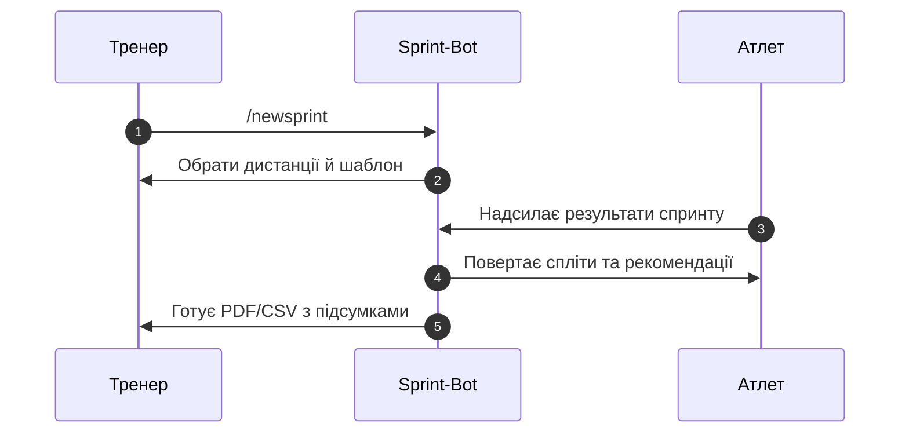
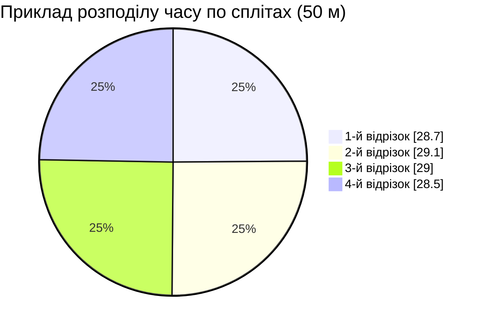

# Sprint-Bot — ваш тренерський штаб у Telegram

Sprint-Bot допомагає тренерам і командам із плавання позбутися хаотичних таблиць та нескінченних чатів. Бот збирає результати спринтів, генерує звіти та нагадує про тренування, а ви фокусуєтесь на роботі з атлетами.

## Цінність для команди

- **Прозорість прогресу.** Спортсмени бачать персональні рекорди й рекомендації одразу після запливу.
- **Контроль за даними.** Результати, шаблони тренувань і резервні копії синхронізуються між Google Sheets та Postgres.
- **Автоматизація рутини.** Нагадування про старти, тихі години, експорт CSV/зображень — усе робиться ботом.
- **Єдина точка правди.** Більше жодних розрізнених документів: тренер, атлет і батьки отримують інформацію в Telegram.

## Ключові можливості

- 🏁 **Спринти за хвилину.** `/newsprint` відкриває реєстрацію, підтягує шаблон дистанцій та запрошує команду.
- 📊 **Аналітика MyRaceData-рівня.** Автоматичний розрахунок сплітів, дельти, прогнозів та графіків у PDF/PNG.
- 🔔 **Розумні сповіщення.** Тихі години, персональні нагадування, push-повідомлення про рекорди та дедлайни.
- 🧩 **Конструктор шаблонів.** Імпорт із Google Sheets чи CSV, готові макети тренувань для груп і індивідуалок.
- ☁️ **Бекапи без стресу.** S3/MinIO, шифрування, контроль версій і автоматичний restore-скрипт.
- 🔐 **Безпека за замовчуванням.** Маскування персональних даних у логах, Sentry-алерти й healthcheck контейнера.

## Як стартувати

1. Клонуйте репозиторій та виконайте швидку перевірку залежностей.
2. Заповніть `.env` на основі шаблону.
3. Запустіть бот локально або в Docker.

👉 Детальна інструкція «з нуля до продакшену» — у [SETUP.md](SETUP.md).

## Архітектура та процеси

- [ARCHITECTURE.md](ARCHITECTURE.md) — шарова модель (бот → application → domain → infrastructure), зовнішні інтеграції, події.
- [OPERATIONS.md](OPERATIONS.md) — резервні копії, міграції БД, ротація ключів, оновлення та моніторинг.
- [SECURITY_NOTES.md](SECURITY_NOTES.md) — політика секретів і гайдлайни з харднінгу.
- [docs/UX.md](docs/UX.md) — сценарії онбордингу й роботи з ботом.

## Робочі процеси для розробників

- **Якість коду.** `make format` (isort + black), `make lint` (ruff + mypy), `make test` (pytest із покриттям).
- **CI/CD.** GitHub Actions (`lint`, `tests`, `docker`) збирають образи та перевіряють код при кожному пуші.
- **Залежності.** `requirements.txt` містить runtime і dev-пакети; `pyproject.toml` налаштовує форматери та mypy.
- **Міграції й імпорт.** `make migrate` проганяє Alembic, `make import_sheets` підтягує історичні дані з Google Sheets.

## Дорожня карта

- Health/ready endpoint для продакшен-моніторингу.
- Ліниве підключення Google Sheets і кешування запитів.
- Більше інтеграцій для push-панелей (Slack, e-mail, webhooks).

Sprint-Bot створений тренером для тренерів. Підключайте бот, і кожен спринт працюватиме на медалі.

