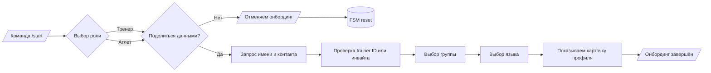
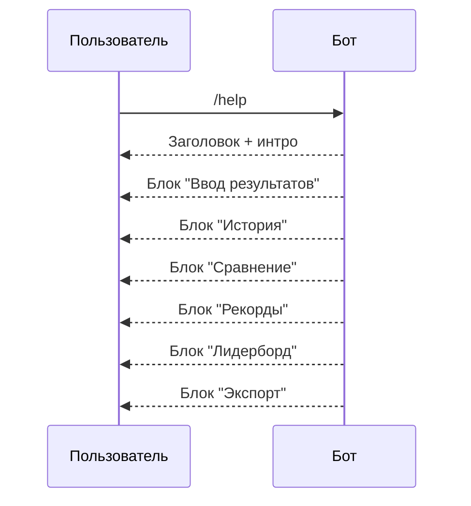
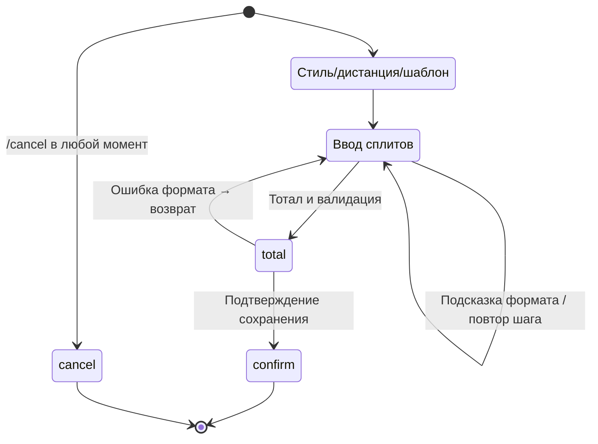

# Sprint Bot Scenario Playbook

## /start Onboarding
- **Happy path**: роль → приватность → имя → тренер → группа → язык → карточка профиля.
- **Защита**: отказ приватности сбрасывает состояние и отзывает инвайт; неверные trainer-ID/инвайты дают подсказки.
- **Сценарные тесты**: `tests/test_onboarding_flow.py` покрывает happy-path, отказ приватности и deep-link-инвайт.

## /help Справка
- Сообщение разбито на блоки: ввод, история, сравнение, рекорды, лидерборд, экспорт.
- Строки локализованы (uk/ru) и проверяются в `tests/test_bot_i18n.py`.
- Хэндлер не требует состояний — доступен всегда, безопасен к спаму.

## Мастер ввода сплитов
- Шаги: стиль/дистанция → шаблон → сплиты → тотал → подтверждение.
- Поддерживает форматы `mm:ss.ss`, `см/мс`, `repeat/cancel`, автосумму и выравнивание.
- Тесты (`tests/test_add_wizard.py`, `tests/test_add_wizard_i18n.py`) закрывают happy-path, отмену, повтор и ошибки формата.

